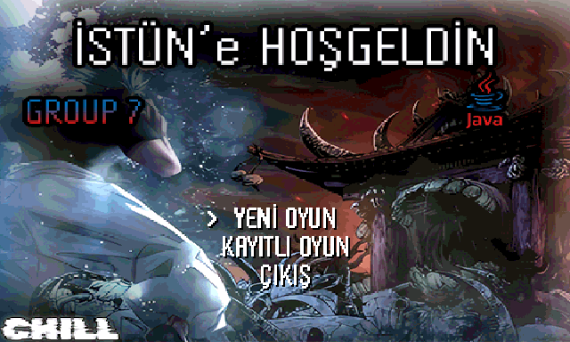
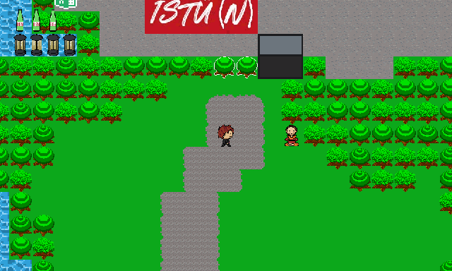
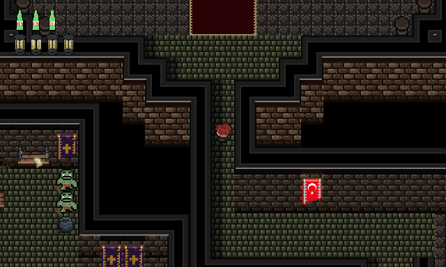
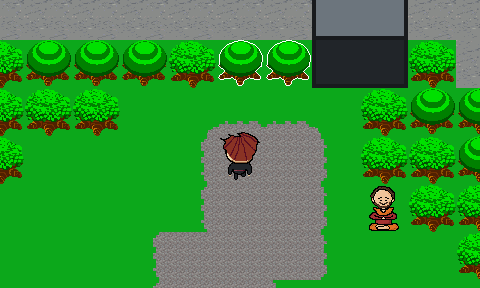
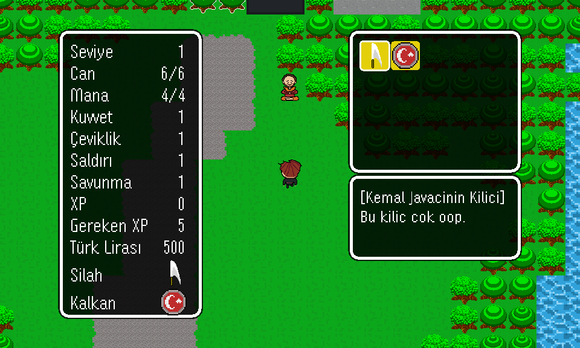
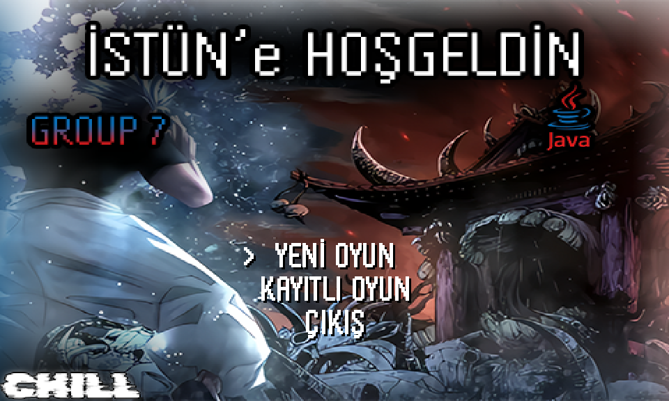
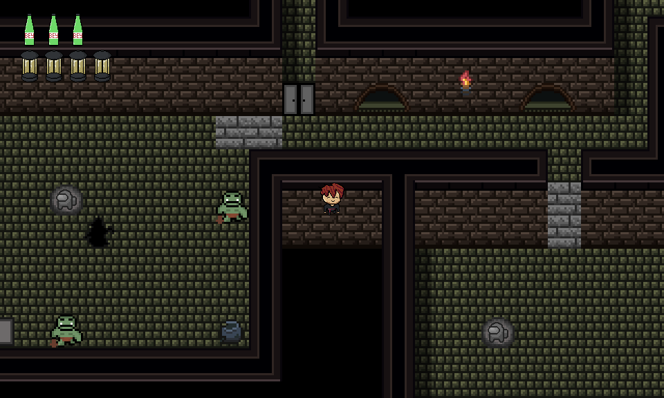
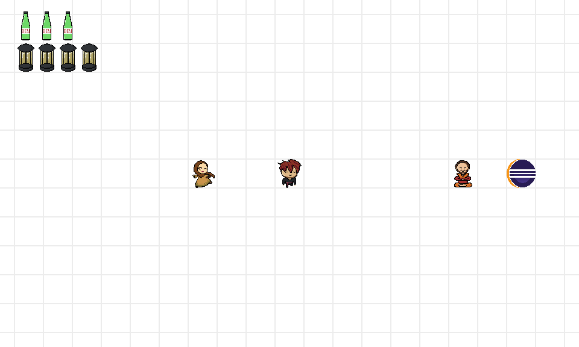

<div align="center">

# İSTÜN'e Hoş Geldin

**A story-driven 2D action RPG set on our university campus, written from scratch in pure Java (Swing / Java2D), with no game engine.**




</div>

You wake up as **Hüseyin** in a strange version of İSTÜN (Istanbul Health and Technology University), where nobody remembers who they are. Explore the campus, help the people you meet get their memories back, fight your way through the dungeon under the school and take on the final boss: **GPT**.

> The in-game text is in Turkish.

## A quick look

| | |
|:---:|:---:|
| <br>**Meet the campus.** Everyone has forgotten who they are, and the right words bring their memories back. | <br>**Face GPT.** A cutscene, a villain monologue and then the boss fight. |
| <br>**Use your tools.** Cut trees with the axe, break walls with the pickaxe. | <br>**Level up.** Stats, equipment and inventory. |

<p align="center">
  
  
  
</p>

## Features

**Engine (built from scratch on Swing / Java2D)**
- Fixed-timestep game loop running at 60 updates per second on its own thread, rendering to a double-buffered `JPanel`
- Tile-based worlds: 5 maps loaded from text files, 410 tile types with per-tile collision, and a camera that follows the player
- Rendering sorted by Y position, so characters and objects overlap correctly
- Collision detection between the player, tiles, NPCs, monsters, objects and projectiles
- Game-state machine covering title, play, pause, dialogue, character screen, options, trade, map transition, cutscene and game over
- Sound system for background music and sound effects (`javax.sound.sampled`), with volume settings

**Gameplay**
- Melee combat with attack hitboxes, knockback, shield guard and parry, and invincibility frames
- Projectiles that cost mana (fireball for the player, ranged attacks for enemies) plus a particle system
- Enemy AI that chases the player with **A\* pathfinding**
- Two-phase boss fight (the boss changes sprites and behaviour once it is enraged), a scripted cutscene before it and boss music
- NPC dialogue with a typewriter effect, with dialogue sets that change as the story progresses
- Inventory, equipment (sword, axe, pickaxe, shield), consumables, levelling and XP, and a merchant trade screen
- Interactive tiles: trees you cut with the axe, walls you break with the pickaxe, and pressure plates you solve by pushing rocks to open iron doors
- Save and load using Java object serialization
- Options menu with music and sound-effect volume, a controls page and quit-to-title, plus a debug overlay and god mode for development

**Original content**

The core architecture follows [RyiSnow's tutorial series](#credits). Everything built on top of it was made for this game:
- The setting: the İSTÜN campus with A, B and C blocks, a classroom map, a dungeon, a boss hall and the white void
- An original story with Turkish dialogue and new NPCs (Eray, Feyza, Ali, Makineci and others), each with their own dialogue flow, and some with custom animations
- New items and objects: the Hougyoku key item, the Eclipse Stone, Turkish lira coins, campus turnstiles and classroom laptops
- A reskinned final boss, an ending cutscene and end credits

## Controls

| Key | Action |
|---|---|
| `W` `A` `S` `D` | Move |
| `Enter` | Interact / attack / confirm |
| `Space` | Guard with shield (parry if timed) |
| `F` | Cast projectile (uses mana) |
| `C` | Character and inventory screen |
| `P` | Pause |
| `Esc` | Options |
| `T` / `G` | Debug overlay / god mode (development) |

## Running the game

**Requirements:** JDK 17 or newer (developed with JDK 22).

**From the command line**

```bash
git clone https://github.com/EfeHasNoLuck/2D-game.git
cd 2D-game/My2DGame
javac -encoding UTF-8 -d out $(find src -name "*.java")
java -cp "out:res" main.Main      # on Windows use: java -cp "out;res" main.Main
```

**From Eclipse:** *File → Import → Existing Projects into Workspace*, select the `My2DGame` folder, then run `main.Main`.

## Project structure

```
My2DGame/
├── src/
│   ├── main/              Game loop (GamePanel), input, UI, collision, events, cutscenes, sound
│   ├── entity/            Entity base class, Player, NPCs, projectiles, particles
│   ├── monster/           Slime, Orc and the boss
│   ├── object/            Items, weapons, doors, chests, consumables
│   ├── tile/              Tile map loading and rendering
│   ├── tile_interactive/  Cuttable trees, breakable walls, pressure plates
│   ├── ai/                A* pathfinding
│   └── data/              Save / load (serialization)
└── res/                   Sprites, tiles, maps, sounds, font
```

## Credits

Made together by **Group 7** at Istanbul Health and Technology University.

| | |
|---|---|
| **Ahmet Efe Saygılı** ([@EfeHasNoLuck](https://github.com/EfeHasNoLuck)) | Code, pixel art and character design |
| **Ahmed Hamza Kerman**, **Hasan Ulaş Çelik**, **Hüseyin Can Çaltı** | Pixel art and character design |

**Special thanks**
- [RyiSnow](https://www.youtube.com/@RyiSnow): this project was built while following his *How to Make a 2D Game in Java* series. The engine architecture comes from the series, and some of the base sprites and sound effects come from its resources.
- [Piskel](https://www.piskelapp.com/): used for the pixel art.

Some music tracks, the title-screen background and the logos used in the game belong to third parties. They are included only for this non-commercial student project, and all rights stay with their owners.
